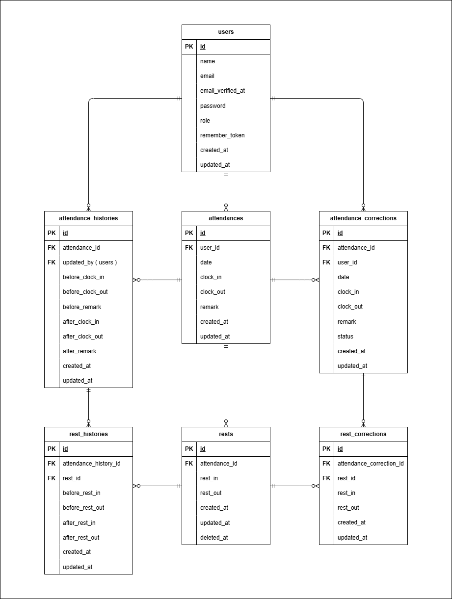

# 勤怠管理アプリ

## デフォルトログイン情報

### 管理者ユーザー
- メールアドレス: admin@example.com
- パスワード: adminpass

### 一般ユーザー
- メールアドレス: test@example.com
- パスワード: password


## 環境構築

### Dockerビルド

1. `git clone git@github.com:some-git-hub/attendance-management.git`

2. `docker-compose up -d --build`

> MySQLはOSによって起動しない場合があるため、  
> それぞれのPCに合わせて「docker-compose.yml」を編集してください。


### Laravel 環境構築

1. `docker-compose exec php bash`

2. `composer install`

3. `cp .env.example .env`

4. 「.env」に以下の環境変数を追記する。

```text
DB_CONNECTION=mysql
DB_HOST=mysql
DB_PORT=3306
DB_DATABASE=laravel_db
DB_USERNAME=laravel_user
DB_PASSWORD=laravel_pass
```

5. `php artisan key:generate`

6. `php artisan migrate --seed`


### MailHog 環境構築

1. 「.env」に以下の環境変数を追記する。

```text
MAIL_MAILER=smtp
MAIL_HOST=mailhog
MAIL_PORT=1025
MAIL_USERNAME=null
MAIL_PASSWORD=null
MAIL_ENCRYPTION=null
MAIL_FROM_ADDRESS=attendance@management.com
MAIL_FROM_NAME="AttendanceManagement"
```

2. http://localhost:8025 にアクセスすると、開発環境でメール送信を確認できる。


### テスト環境構築

1. 「.env.testing」を作成する。

```bash
docker-compose exec php bash
cp .env .env.testing
```

2. 「.env.testing」に以下の環境変数を追記する。

```text
DB_CONNECTION=mysql
DB_HOST=mysql
DB_PORT=3306
DB_DATABASE=demo_test
DB_USERNAME=root
DB_PASSWORD=root
```

3. テスト用DBを作成する。(パスワード:**root**)

```bash
docker-compose exec mysql bash
mysql -u root -p
CREATE DATABASE demo_test;
```

4. テストを実行する。

```bash
docker-compose exec php bash
php artisan migrate --seed --env=testing
php artisan test
```


## 使用技術

- PHP 8.1.33
- Laravel 8.83.8
- MySQL 8.0.26
- Nginx 1.21.1
- MailHog（開発環境でのメール送信確認）


## ER図




## URL

- 開発環境（一般ユーザーログイン画面）: http://localhost/login/
- 開発環境（管理者ログイン画面）: http://localhost/admin/login/
- phpMyAdmin: http://localhost:8080/
- MailHog: http://localhost:8025/